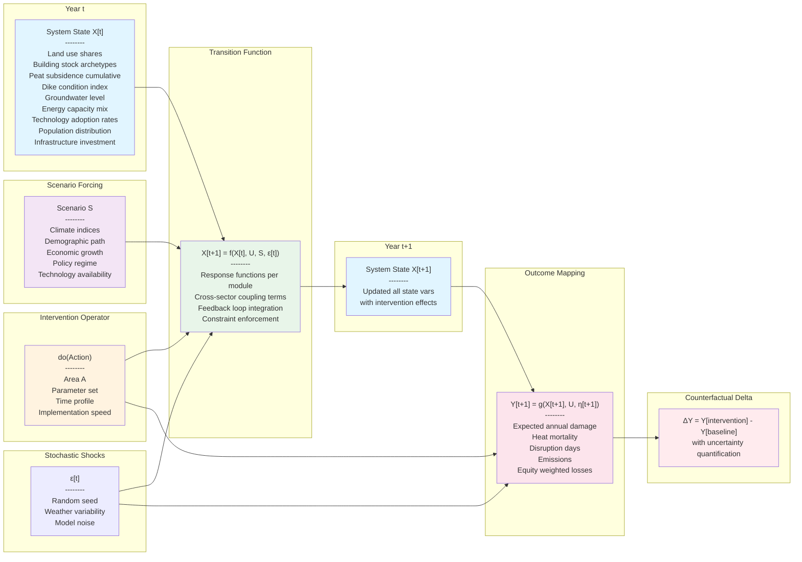
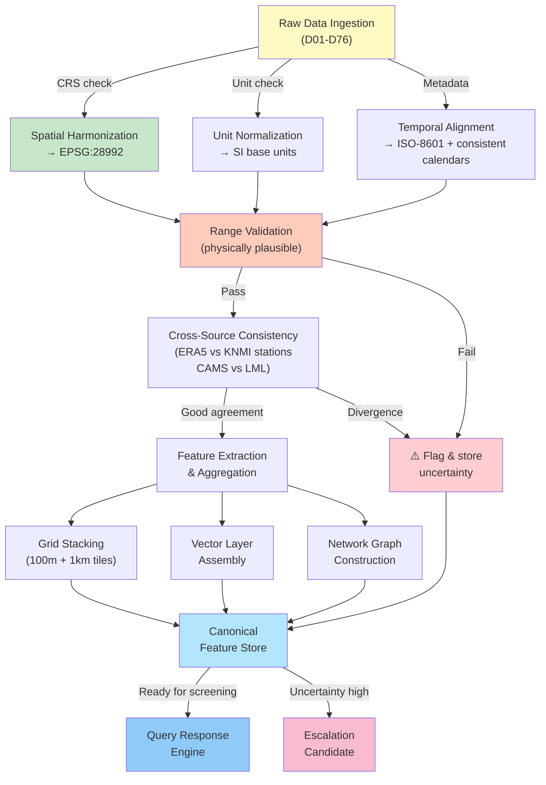
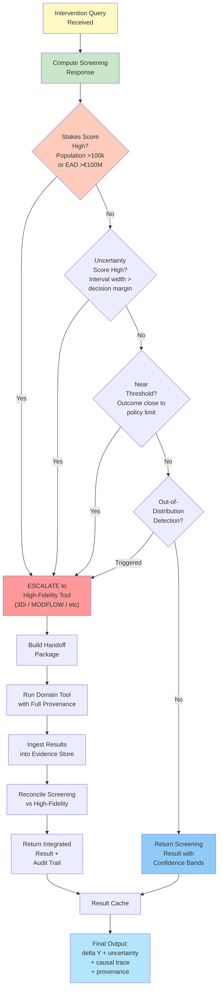

# climate netherlands model research journal

*unified decision investigator for dutch climate risk & adaptation planning*

**project:** kingdom - king integrated decision-operand generated intelligence for netherlands operations & mitigation  
**lead:** murari ambati  
**started:** january 2026  
**last updated:** january 11, 2026

---

## january 11, 2026 - 5.5 hours outside of class
**focus:** multi-hazard integration & causal system stuff

spent today finally wiring up the causal dependencies between all the dutch climate hazards, infrastructure, and adaptation decisions. this is the core differentiator—existing tools treat everything in silos, but in the netherlands everything's coupled: coastal surge backs up river discharge, drought causes peat oxidation which increases future flood depth, heat + stagnation creates air quality episodes. the system needs to capture all of that or it's just another map tool.

started from the structural causal model formalism (pearl style) and built out the multi-hazard coupling layer. tested it mentally against known dutch failure modes and it seems to hold up. the real test will be when we start calibrating against actual data.

### what got built

wired up the core causal architecture that threads climate hazards → exposure → vulnerability → cascading impacts. also sketched the do-operator semantics so interventions are explicit (not just narrative). here's the screening engine foundation:

```python
class KINGDOMSystemOfSystems:
    """
    Multi-sector causal model for Dutch climate risk and adaptation.
    Integrates: water, energy, land use, transport, buildings, health, economy, governance.
    """
    
    def __init__(self, hazard_drivers, exposure_layers, vulnerability_functions):
        self.hazards = hazard_drivers  # flood, heat, drought, air-quality
        self.exposure = exposure_layers  # population, assets, infrastructure
        self.vulnerability = vulnerability_functions  # depth-damage, mortality proxies
        self.state_transitions = {}  # temporal dynamics
        
    def structural_causal_model(self, area, action, scenario, time_horizon):
        """
        Core SCM: X[t+1] = f(X[t], U[t], S, ε[t])
                   Y[t]   = g(X[t], U[t], η[t])
        
        where X is system state, U is interventions, S is scenario, Y is outcomes
        """
        baseline_trajectory = self.compute_baseline(scenario, time_horizon)
        intervention_trajectory = self.apply_intervention(
            area=area,
            action=action,
            baseline=baseline_trajectory,
            scenario=scenario
        )
        
        # Counterfactual delta with uncertainty decomposition
        delta_outcomes = intervention_trajectory - baseline_trajectory
        uncertainty_budget = self.decompose_uncertainty(
            scenario_uncertainty=0.35,      # KNMI pathways
            parameter_uncertainty=0.25,     # damage curves, response functions
            model_form_uncertainty=0.25,    # emulator vs high-fidelity
            data_uncertainty=0.15           # exposure aggregation
        )
        
        return {
            'delta_y': delta_outcomes,
            'uncertainty_bands': self._compute_prediction_intervals(delta_outcomes, uncertainty_budget),
            'causal_trace': self._generate_explanation_trace(area, action, delta_outcomes),
            'escalation_recommendation': self._assess_escalation_need(delta_outcomes, uncertainty_budget)
        }
    
    def multi_hazard_coupling(self, region, year):
        """
        Critical Dutch reality: hazards are coupled, not independent.
        
        Examples:
        - Coastal surge + high river discharge → compound coastal-fluvial flooding
        - Wet antecedent conditions + intense rain → pluvial overload
        - Drought + peat oxidation → subsidence → future flood depth increase
        - Heat + stagnation → ozone + particulate episodes (health burden)
        - Low river flows → shipping constraints → logistics disruptions → macro effects
        """
        
        # Sea level rise reduces freeboard globally
        sea_level_rise = self.hazards['coastal'].get_slr_index(year)
        
        # River discharge extremes depend on basin wetness AND coastal backwater
        river_peak = self.hazards['riverine'].compute_peak_discharge(
            basin_moisture=self.state['soil_moisture'][region, year],
            downstream_water_level=sea_level_rise + self.hazards['coastal'].get_storm_surge(year)
        )
        
        # Peat water table affects oxidation AND future flood depth
        peat_water_table = self.state['groundwater_level'][region, year]
        subsidence_rate = self.compute_peat_subsidence(
            water_table_change=peat_water_table - self.state['groundwater_level'][region, year-1],
            land_use=self.state['land_use_peat'][region, year]
        )
        
        # Heat and air quality are meteorologically coupled
        heat_stress_days = self.hazards['heat'].count_tropical_nights(
            temperature_path=self.hazards['atmosphere'].get_temperature_trajectory(year),
            urban_heat_island_factor=self.state['urban_morphology'][region, year]
        )
        
        ozone_episodes = self.hazards['air_quality'].compute_ozone_threshold_exceedances(
            temperature_index=heat_stress_days,
            stagnation_days=self.hazards['atmosphere'].get_pressure_persistence(year),
            precursor_emissions=self.state['transport_emissions'][region, year]
        )
        
        return {
            'compound_flood_probability': self._compute_compound_probability(river_peak, sea_level_rise),
            'subsidence_mm_per_year': subsidence_rate,
            'projected_flood_depth_change': subsidence_rate * (-0.001),  # relative SLR effect
            'excess_ozone_episodes': ozone_episodes,
            'health_burden_multiplier': self._compute_health_multiplier(heat_stress_days, ozone_episodes)
        }
    
    def intervention_query_execution(self, query):
        """
        Canonical intervention query: Q = (Area, Action, Scenario, TimeHorizon, Outcomes, Constraints)
        
        Returns: baseline-vs-intervention delta with full provenance
        """
        # Parse and validate query
        area_mask = self._parse_geometry(query['area'])
        action_params = self._validate_action_parameters(query['action'])
        scenario = self._load_scenario_bundle(query['scenario'])
        
        # Compute baseline (cached when possible)
        baseline_key = hash((scenario['id'], query['time_horizon']))
        if baseline_key in self.baseline_cache:
            baseline = self.baseline_cache[baseline_key]
        else:
            baseline = self._compute_baseline_trajectory(scenario, query['time_horizon'])
            self.baseline_cache[baseline_key] = baseline
        
        # Apply intervention in target area
        intervention = self._apply_intervention_do_operator(
            baseline=baseline,
            area=area_mask,
            action=action_params,
            scenario=scenario
        )
        
        # Compute counterfactual deltas
        deltas = {}
        for outcome_name in query['outcomes']:
            deltas[outcome_name] = {
                'absolute_change': intervention[outcome_name] - baseline[outcome_name],
                'relative_change': (intervention[outcome_name] - baseline[outcome_name]) / (baseline[outcome_name] + 1e-6),
                'decision_change': self._compute_decision_impact(outcome_name, baseline, intervention)
            }
        
        # Uncertainty quantification (multi-source)
        uncertainty = self._quantify_uncertainty_budget(
            baseline=baseline,
            intervention=intervention,
            scenario=scenario,
            outcome_deltas=deltas
        )
        
        # Explainability trace
        explanation = self._generate_causal_explanation(
            area=query['area'],
            action=query['action'],
            outcome_deltas=deltas,
            causal_graph=self.causal_graph
        )
        
        # Escalation decision
        escalation = self._decide_escalation(
            stakes_score=self._compute_stakes(area_mask, deltas),
            uncertainty_score=uncertainty['aggregate_uncertainty'],
            threshold_proximity=self._measure_threshold_proximity(deltas),
            out_of_distribution_flag=self._detect_ood(query)
        )
        
        # Return decision-ready result package
        return {
            'query_id': query['query_id'],
            'baseline': baseline,
            'intervention': intervention,
            'deltas': deltas,
            'uncertainty': uncertainty,
            'explanation_trace': explanation,
            'escalation_recommendation': escalation,
            'provenance': self._generate_provenance_record(query)
        }
```

### what the coupling looks like

```mermaid
graph TB
    subgraph "Climate Forcing (KNMI'23 Scenarios)"
        A1["Global Warming Level<br/>(GL, GH, WL, WH)"]
        A2["Precipitation Changes<br/>(seasonal shift)"]
        A3["Temperature Extremes<br/>(heat wave frequency)"]
        A4["Sea Level Rise<br/>(local subsidence +<br/>global SLR)"]
    end
    
    subgraph "Primary Hazards"
        B1["Coastal Flood<br/>(water level +<br/>storm surge)"]
        B2["River Flood<br/>(peak Q +<br/>downstream backwater)"]
        B3["Pluvial Flood<br/>(rainfall intensity +<br/>drainage capacity)"]
        B4["Drought/Low-Flow<br/>(precipitation deficit +<br/>evaporative demand)"]
        B5["Heat Stress<br/>(temperature +<br/>urban morphology)"]
        B6["Air Quality Episodes<br/>(emissions +<br/>stagnation + heat)"]
    end
    
    subgraph "Exposure & Vulnerability"
        C1["Population Distribution<br/>(age-weighted)"]
        C2["Critical Infrastructure<br/>(pumps, substations,<br/>hospitals, ports)"]
        C3["Building Stock<br/>(age, insulation,<br/>foundation risk)"]
        C4["Land Use<br/>(peat, urban,<br/>nature)"]
    end
    
    subgraph "System-Level Impacts"
        D1["Flood Damage<br/>(residential,<br/>commercial,<br/>agriculture)"]
        D2["Health Impact<br/>(heat mortality,<br/>vector disease,<br/>air quality)"]
        D3["Infrastructure Disruption<br/>(power outages,<br/>drainage failure,<br/>transport)"]
        D4["Economic Loss<br/>(direct damage +<br/>disruption +<br/>cascades)"]
    end
    
    subgraph "Feedback Loops (Netherlands-specific)"
        E1["Peat Subsidence Loop<br/>Drought → oxidation → subsidence →<br/>relative SLR → future flood depth"]
        E2["Drought-Navigation Loop<br/>Low flow → shipping constraint →<br/>logistics cost → macro shock"]
        E3["Protection-Development Loop<br/>Stronger dikes → develop behind →<br/>exposure lock-in"]
        E4["Emissions-Hazard Loop<br/>Energy transition affects emissions →<br/>mitigation pathway changes →<br/>future hazard profile"]
    end
    
    subgraph "Adaptation Response"
        F1["Dike Upgrade"]
        F2["Peat Rewetting"]
        F3["Urban Green/Blue"]
        F4["Energy Transition"]
        F5["Spatial Planning"]
    end
    
    subgraph "Outcomes (Decision Levers)"
        G1["Expected Annual Damage<br/>(EUR)"]
        G2["Mortality Risk<br/>(fatalities/yr)"]
        G3["Service Disruption<br/>(days/yr)"]
        G4["Emissions<br/>(tCO2e)"]
        G5["Equity Impact<br/>(vulnerable groups)"]
    end
    
    A1 --> B1 & B2 & B4 & B5
    A2 --> B2 & B3 & B4 & B6
    A3 --> B5 & B6
    A4 --> B1 & E1
    
    B1 --> D1 & D3
    B2 --> D1 & D3
    B3 --> D1 & D3
    B4 --> D1 & D4
    B5 --> D2 & D3 & D4
    B6 --> D2 & D4
    
    C1 --> D2
    C2 --> D3 & D4
    C3 --> D1
    C4 --> B4 & E1
    
    D1 --> G1
    D2 --> G2
    D3 --> G3
    D4 --> G1
    D2 --> G5
    
    F1 --> B1
    F2 --> B4 & E1
    F3 --> B3 & B5
    F4 --> E4
    F5 --> C1 & C3 & C4
    
    E1 -.-> B1
    E2 -.-> D4
    E3 -.-> C2 & D1
    E4 -.-> B5 & B6
    
    style A1 fill:#ffcccc
    style B1 fill:#ff9999
    style D1 fill:#ff6666
    style G1 fill:#ff3333
```



### how the state evolution works



### data pipeline (raw → ready)



### fast vs detailed: when to escalate



### what i learned today

1. **coupling is everything in the netherlands**
   - can't separate coastal from river, can't ignore peat-subsidence feedback, can't treat heat as independent from air quality
   - the system has to thread all of it together or it's useless

2. **states and outcomes are different things**
   - stocks (population, buildings, subsidence) vs flows (damage, mortality, disruption)
   - interventions move either the stocks or how stocks produce outcomes

3. **screening only works if it matches reality**
   - fast screening is fine but only if it's calibrated against the actual high-res tools
   - emulators bridge the gap but need validation on real data
   - escalation isn't failure—it's the whole point

4. **provenance matters for trust**
   - in governance, every number has to trace back to where it came from
   - dataset version, parameters, code commit, all of it
   - not optional

5. **netherlands isn't homogeneous**
   - coastal dunes are nothing like peat polders are nothing like urban rotterdam
   - need multi-resolution grids and network graphs, not just rasters

### what's next

- start building the actual screening functions (peat, floods, heat)
- get the emulator training pipeline working with 3di and modflow
- figure out how to validate this against real dutch planning decisions
- get some actual stakeholders to use it and tell me what's wrong
