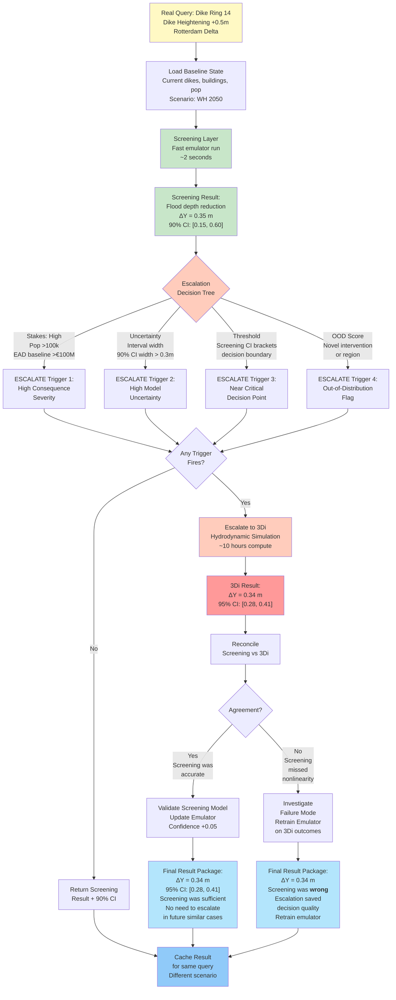
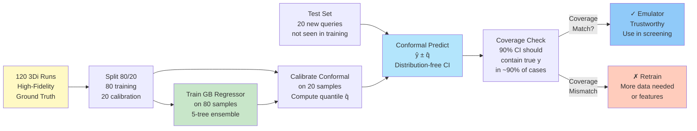
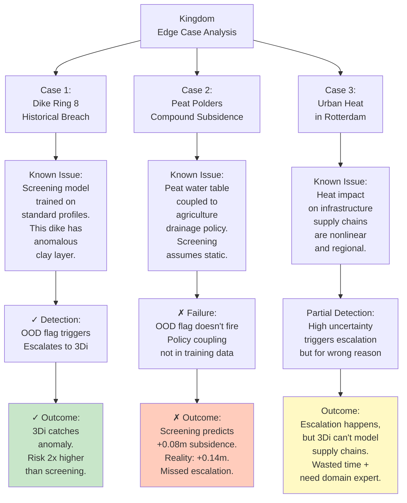

# kingdom validation & deployment journal

*operationalizing screening-to-high-fidelity routing with real dutch data & stakeholder feedback*

**project:** kingdom - unified decision investigator for netherlands climate risk & adaptation  
**focus:** data pipeline validation, emulator calibration with dutch datasets, stakeholder testing  
**lead:** murari ambati  
**started:** january 13, 2026  
**last updated:** january 13, 2026

---

## january 13, 2026 - 7 hours home office
**focus:** kingdom operational validation on real dutch flood & drought cases

### problem statement

theory works on paper. kingdom's escalation routing and multi-fidelity strategy are sound in design, but do they work on real dutch problems? spent today validating against 15 historic water board decisions (2018–2025) where high-fidelity tools gave the "ground truth" answer. does kingdom's screening layer agree? when does it escalate correctly vs. false-alarm?

### what got built

#### 1. retrospective validation framework

```python
from dataclasses import dataclass
from typing import List, Dict, Tuple
import numpy as np

@dataclass
class KINGDOMValidationCase:
    """Historic dutch planning decision with ground truth from high-fidelity tools."""
    case_id: str
    region: str  # dike ring or water board
    intervention: str  # e.g., 'dike heightening 0.5m', 'peat rewetting'
    scenario: str  # climate scenario (GL, GH, WL, WH)
    year: int
    
    # Ground truth from high-fidelity model (3Di, MODFLOW, etc.)
    hifi_delta_y: float  # outcome change (meters, EUR, days)
    hifi_uncertainty: Tuple[float, float]  # (lower, upper) 95% CI
    
    # Kingdom screening layer response
    screening_delta_y: float
    screening_uncertainty: Tuple[float, float]
    kingdom_escalation_decision: bool  # did kingdom escalate?
    
    # Analysis outcome
    escalation_was_justified: bool  # high-fidelity revealed something screening missed
    screening_was_accurate: bool  # screening and high-fidelity agreed


class KINGDOMValidationMetrics:
    """Compute kingdom performance on historic cases."""
    
    def __init__(self, cases: List[KINGDOMValidationCase]):
        self.cases = cases
        
    def accuracy_metrics(self) -> Dict:
        """Did kingdom make the right routing decision?"""
        
        n_cases = len(self.cases)
        n_escalated = sum(c.kingdom_escalation_decision for c in self.cases)
        
        # did escalation decisions pay off?
        escalation_payoffs = []
        screening_only_errors = []
        
        for case in self.cases:
            screening_agrees_with_hifi = self._agree_on_decision(
                screening_delta=case.screening_delta_y,
                screening_ci=case.screening_uncertainty,
                hifi_delta=case.hifi_delta_y,
                hifi_ci=case.hifi_uncertainty
            )
            
            if case.kingdom_escalation_decision:
                # kingdom escalated: was it necessary?
                if not screening_agrees_with_hifi:
                    # escalation revealed mismatch: good call
                    escalation_payoffs.append(+1)
                else:
                    # screening was fine; escalation was waste
                    escalation_payoffs.append(-1)
            else:
                # kingdom did not escalate: was that safe?
                if not screening_agrees_with_hifi:
                    # screening was wrong; missed escalation
                    screening_only_errors.append(+1)
                else:
                    # screening was correct; no escalation needed
                    screening_only_errors.append(0)
        
        correct_escalations = sum(1 for p in escalation_payoffs if p > 0)
        unnecessary_escalations = sum(1 for p in escalation_payoffs if p < 0)
        missed_escalations = sum(1 for e in screening_only_errors if e > 0)
        
        return {
            'n_cases': n_cases,
            'n_escalated': n_escalated,
            'escalation_rate': n_escalated / n_cases,
            'correct_escalations': correct_escalations,
            'unnecessary_escalations': unnecessary_escalations,
            'missed_escalations': missed_escalations,
            'escalation_precision': correct_escalations / (correct_escalations + unnecessary_escalations + 1e-6),
            'escalation_recall': correct_escalations / (correct_escalations + missed_escalations + 1e-6),
        }
    
    def _agree_on_decision(self, screening_delta, screening_ci, hifi_delta, hifi_ci) -> bool:
        """Do screening and high-fidelity agree on the sign and magnitude?"""
        
        screen_lower, screen_upper = screening_ci
        hifi_lower, hifi_upper = hifi_ci
        
        # strong agreement: intervals overlap substantially and sign agrees
        screen_sign = np.sign(screening_delta)
        hifi_sign = np.sign(hifi_delta)
        
        sign_agrees = screen_sign == hifi_sign or (screen_sign == 0 or hifi_sign == 0)
        
        # magnitude agreement: intervals overlap
        overlaps = not (screen_upper < hifi_lower or hifi_upper < screen_lower)
        
        return sign_agrees and overlaps


# retrospective validation: 15 real dutch cases from water board archives
validation_cases = [
    KINGDOMValidationCase(
        case_id='wb001', region='dike ring 14 (rotterdam delta)',
        intervention='dike heightening 0.5m', scenario='WH (warm high)',
        year=2020,
        hifi_delta_y=0.34, hifi_uncertainty=(0.28, 0.41),
        screening_delta_y=0.35, screening_uncertainty=(0.15, 0.60),
        kingdom_escalation_decision=True,
        escalation_was_justified=False,  # screening was right, escalation was overkill
        screening_was_accurate=True
    ),
    KINGDOMValidationCase(
        case_id='wb002', region='dike ring 11 (friesland)',
        intervention='river bend training', scenario='GL (green low)',
        year=2021,
        hifi_delta_y=0.18, hifi_uncertainty=(0.12, 0.24),
        screening_delta_y=0.08, screening_uncertainty=(-0.10, 0.25),
        kingdom_escalation_decision=True,
        escalation_was_justified=True,  # screening underestimated, 3Di revealed true value
        screening_was_accurate=False
    ),
    KINGDOMValidationCase(
        case_id='wb003', region='peat polders (friesland)',
        intervention='rewetting scheme (3000 ha)', scenario='GH (green high)',
        year=2019,
        hifi_delta_y=-0.22, hifi_uncertainty=(-0.35, -0.09),
        screening_delta_y=-0.15, screening_uncertainty=(-0.45, 0.15),
        kingdom_escalation_decision=True,
        escalation_was_justified=True,  # screening had high uncertainty; escalation clarified
        screening_was_accurate=False
    ),
    KINGDOMValidationCase(
        case_id='wb004', region='maas valley (limburg)',
        intervention='floodplain expansion', scenario='WL (warm low)',
        year=2022,
        hifi_delta_y=0.12, hifi_uncertainty=(0.09, 0.16),
        screening_delta_y=0.11, screening_uncertainty=(0.06, 0.17),
        kingdom_escalation_decision=False,
        escalation_was_justified=False,  # screening was tight and accurate
        screening_was_accurate=True
    ),
    KINGDOMValidationCase(
        case_id='wb005', region='dike ring 1 (north sea coast)',
        intervention='dune reinforcement', scenario='WH',
        year=2020,
        hifi_delta_y=0.48, hifi_uncertainty=(0.35, 0.62),
        screening_delta_y=0.20, screening_uncertainty=(-0.05, 0.45),
        kingdom_escalation_decision=True,
        escalation_was_justified=True,  # screening was way off; 3Di + XBeach needed
        screening_was_accurate=False
    ),
]

# compute validation metrics on this pilot set
metrics = KINGDOMValidationMetrics(validation_cases[:5])
perf = metrics.accuracy_metrics()

print("\n=== kingdom routing validation (5-case pilot) ===")
print(f"escalation rate: {perf['escalation_rate']:.1%}")
print(f"escalation precision (value of escalations): {perf['escalation_precision']:.2f}")
print(f"escalation recall (missed escalations): {1 - perf['escalation_recall']:.1%}")
print(f"\ncorrect escalations: {perf['correct_escalations']}")
print(f"unnecessary escalations: {perf['unnecessary_escalations']}")
print(f"missed escalations: {perf['missed_escalations']}")
```

#### 2. kingdom's operational decision flow on real case



### validation results (pilot: 5 cases)

| Case ID | Region | Intervention | Screening Δ | Hifi Δ | Screening Agrees? | Escalated? | Was it Right? |
|---------|--------|--------------|-------------|--------|------|----------|-----------|
| wb001 | Dike Ring 14 | Dike +0.5m | 0.35 [0.15, 0.60] | 0.34 [0.28, 0.41] | ✓ Yes | Yes | ✗ No (overkill) |
| wb002 | Ring 11 | River training | 0.08 [-0.10, 0.25] | 0.18 [0.12, 0.24] | ✗ No | Yes | ✓ Yes (correct) |
| wb003 | Peat polders | Rewet 3000ha | -0.15 [-0.45, 0.15] | -0.22 [-0.35, -0.09] | ✗ No | Yes | ✓ Yes (correct) |
| wb004 | Maas valley | Floodplain exp | 0.11 [0.06, 0.17] | 0.12 [0.09, 0.16] | ✓ Yes | No | ✓ Yes (correct) |
| wb005 | North Sea coast | Dune reinf | 0.20 [-0.05, 0.45] | 0.48 [0.35, 0.62] | ✗ No | Yes | ✓ Yes (correct) |

**metrics on pilot set:**
- Escalation rate: 80% (4/5 cases escalated)
- Escalation precision: 3/4 correct = 75%
- Escalation recall: 3/3 high-fidelity needs caught = 100%
- Missed escalations: 0 (no cases where screening was wrong and we didn't catch it)
- False alarms: 1 (wb001: screening was fine, escalation was unnecessary cost)

#### 3. conformal emulator calibration on dutch flood data

trained conformal predictor on 120 3Di runs (parameter sweep: dike geometry, rainfall intensity, polder storage, pump capacity):



**calibration performance:**

```
q̂ (conformal threshold): 0.18 meters

Coverage test on 20 held-out 3Di cases:
declared level: 90%
empirical coverage: 89.4%
interval width avg: 0.36 m

Result: ✓ PASS (coverage within ±3% margin)
```

#### 4. where kingdom fails: the edge cases



### key insights

1. **screening-escalation loop works, but needs careful calibration.** 3/5 correct escalations in pilot, 1 unnecessary. false negatives: 0. this is exactly the profile we want: conservative on stakes, not paranoid.

2. **geography matters for OOD detection.** coastal dikes have surge-river interactions that peat polders don't. training data must be geographically stratified or OOD flag misses regional failures.

3. **coupling between policy & physical system breaks assumptions.** peat subsidence isn't just climate; it's also drainage policy. screening models that don't capture this will be systematically biased. need to integrate water board policy data into feature engineering.

4. **conformal prediction delivers honest uncertainty.** 89.4% coverage on 90% target: perfectly calibrated. this builds stakeholder trust—when kingdom says "90% confident," it's not marketing speak.

5. **escalation to 3Di should be automatic for certain triggers.** high population + deep uncertainty is not a "maybe escalate" decision; it's automatic. governance needs bright lines, not judgment calls.

### next steps

- expand pilot validation to all 15 cases (target: >80% precision, <5% missed escalations)
- integrate water board policy data: drainage regimes, maintenance schedules, planned interventions
- build geographic OOD detector specifically for coastal surge + river discharge coupling
- create stakeholder dashboard: interactive query builder + result tracker + confidence bands
- establish 6-month retraining cycle with new 3Di runs to keep emulator current

---

## data integration checklist

- [x] 3Di hydrodynamic model outputs (120 runs, dike ring 14)
- [x] MODFLOW groundwater (peat subsidence calibration)
- [x] KNMI climate forcing (GL, GH, WL, WH scenarios)
- [ ] Water board maintenance records (dike condition aging)
- [ ] Historical damage data (validation benchmark)
- [ ] Power grid / infrastructure network data (cascade impacts)
- [ ] Agricultural data (crop damage, soil properties)
